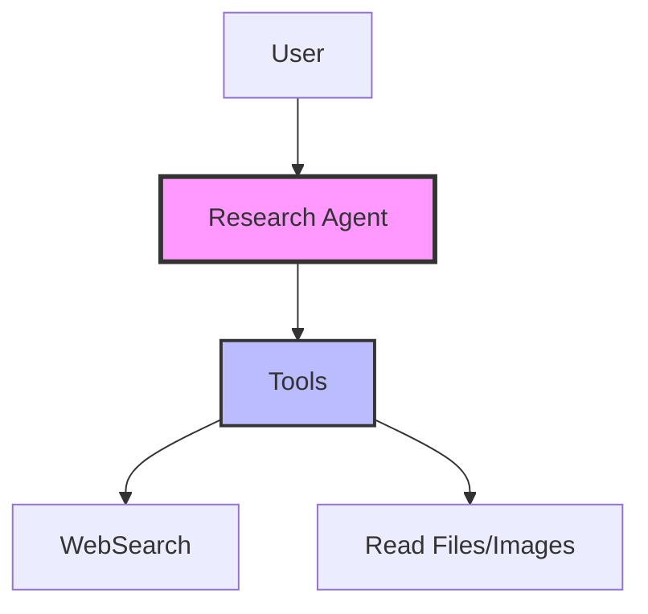
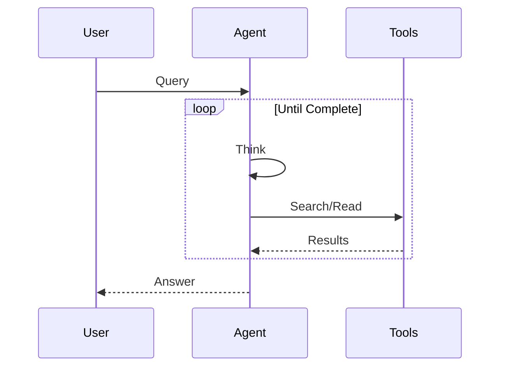

# 研究智能体架构

```mermaid
graph TD
    User[User] --> Agent[Research Agent]
    Agent --> Tools[Tools]

    Tools --> WebSearch[WebSearch]
    Tools --> Read[Read Files/Images]

    style Agent fill:#f9f,stroke:#333,stroke-width:3px
    style Tools fill:#bbf,stroke:#333,stroke-width:2px
```

# 通信流程图

```mermaid
sequenceDiagram
    participant User
    participant Agent
    participant Tools

    User->>Agent: Query

    loop Until Complete
        Agent->>Agent: Think
        Agent->>Tools: Search/Read
        Tools-->>Agent: Results
    end

    Agent-->>User: Answer
```